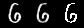

## Naive Autoencoder for MNIST dataset
This is a small part of a project I worked on during my internship. (See more at [here](https://zhuanlan.zhihu.com/p/99066457))  
I thought it would be fun to make some changes and use it on the [MNIST dataset](https://github.com/myleott/mnist_png).  
Will update the results later. Enjoy!

Results Demo (Original, Reconstructed, Binarized):   
  
  
  

2D Visualization:  
 